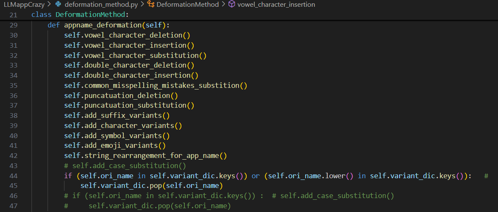
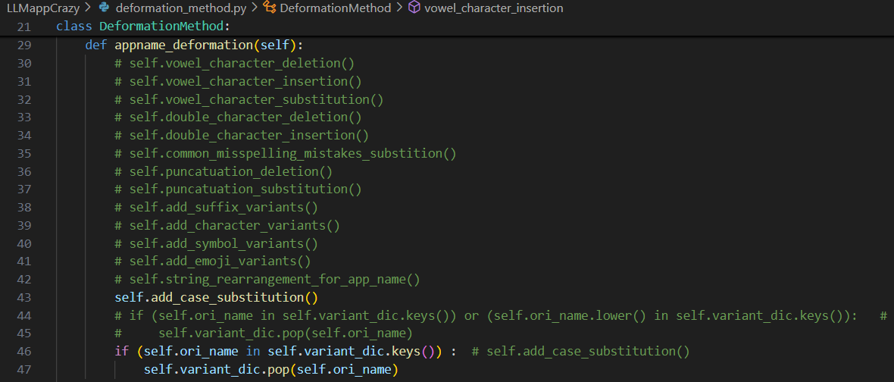

# LLMappCrazy

We summarize 14 deformation models for LLM app squatting. In particular, We have improved the tool "AppCrazy" and proposed the tool "LLMappCrazy" for LLM apps, which is capable of automatically generating variations of LLM app identifiers.

Squatting-generation Models:

#### 1、How to use.

```
python llmappcrazy.py --appname "ExampleAppName" --file "output.csv"
```

The above commands can be run directly to generate various squatting variants for an app.

Or you can prepare a csv file with multiple app names, like "top_1000_gpts.csv". Then you can modify the variable values in the code file "cmd.py" to batch the apps in your csv file.

#### 2、Pay attention. 

Because the first 13 models need to ignore the case difference when generating the variant, but the last model (i.e. case_substitution) needs to retain the case information of the original name when generating the variant, so it is necessary to manually comment out part of the code at runtime to run the two cases separately.

（1）The first 13 models：



（2）The last model (i.e. case_substitution)：




		

#### 3、Result File.

The folder "result" contains the following two sample files:

（1）result_of_first_13_models.csv: Corresponding to 2 (1) above.

（2）result_of_case_substitution_models.csv: Corresponding to 2 (2) above.

Both files have the following structure:

    column1: Squatting Name;
    column2: Variant;

